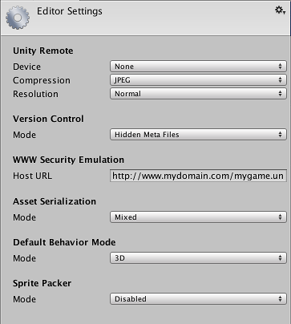

# Unity笔记2
> 17/1/2 unity5.5

## [Setting Manager 设置管理器](https://docs.unity3d.com/Manual/comp-ManagerGroup.html)

### [Audio Manager](https://docs.unity3d.com/Manual/class-AudioManager.html)

属性 | 功能
------------ | -------------
Volume | 总音量
Rolloff Scale | 设置衰减因子(参见 [Audio Source]()). 值越高衰减越快(值为１代表真实世界).
Doppler Factor | 多普勒效应强弱.0代表关闭 1 代表对快速移动的物体效果很明显.
Default Speaker Mode | 设置默认的扬声器模式,默认为双声道. (参见 [AudioSpeakerMode]()).
Sample Rate | 输出采样率.如果设置为0,则使用系统采样率. 注意,只有几个平台允许修改这项,例如 iOS 或 Android平台.
DSP Buffer Size | DSP缓冲大小,可以设置为性能优先或低延迟优先 *Default* 默认的缓冲大小 *Best Latency* 最低延迟 *Good Latency*	平衡 *Best Performance* 性能优先
Virtual Voice Count | 音频系统管理的虚拟声音数.数值应当大于游戏中正在播放的声音个数(其中一些可能没有被真正播放)。否则，控制台中将输出警告信息。
Real Voice Count | 音频系统管理的真实声音数,即同时真实可听到的声音数.超过设定数值时,部分较小的声音将不会被真正播放出来. (参见 [AudioSettings5.0](https://docs.unity3d.com/Manual/UpgradeGuide5-Audio.html))
Disable Audio | 在单独的构建中禁用声音系统. 这也会影响MovieTexture的音频.在编辑器中不受影响.

### [Editor settings](https://docs.unity3d.com/Manual/class-EditorManager.html)

属性 | 功能
------------ | -------------
Device |远程测试的设备类型 (Android, iOS 或 none).
Compression | 将游戏屏幕图像发送到对应设备的压缩类型. JPEG类型有更高的压缩率,PNG类型有更准确清晰的画面.
Resolution | 选择设备如何显示游戏画面,normal更精细,downsized性能更好.
Version Control Mode | 选择使用的版本控制系统. (参见 [版本控制](https://docs.unity3d.com/Manual/VersionControl.html))
Asset Serialization Mode  | 辅助版本控制合并, Unity可以使用文本格式存储场景文件 (参见 [基于文本的场景文件](https://docs.unity3d.com/Manual/TextSceneFormat.html)).如果不对场景进行合并,Unity可以使用更节省空间的二进制格式或者两者并存.
Default Behavior Mode | 默认的编辑器模式,可选择2D或3D模式(参见 [2D与3D模式](https://docs.unity3d.com/Manual/2Dor3D.html))
Sprite Packer Mode | 设置启用/仅构建时启用/禁用 Sprite Packer(精灵打包器)(参见 [Sprite Packer](https://docs.unity3d.com/Manual/SpritePacker.html))

### [Input Manager](https://docs.unity3d.com/Manual/class-InputManager.html)

属性 | 功能
------------ | -------------
Axes |　包含所有当前项目定义的输入轴,Size 定义一共有多少种输入轴.
Name | 输入轴的名称,可以在游戏启动器和脚本中使用.
Descriptive Name | 数值增加按钮的详细定义,显示在游戏启动器界面.
Descriptive Negative Name	数值减少按钮的详细定义,显示在游戏启动器界面.
Negative Button	数值减少按钮
Positive Button	数值增加按钮
Alt Negative Button	次要数值减少按钮
Alt Positive Button	次要数值增加按钮
Gravity	数值变化速度.仅在按键情况下有效
Dead	当输入值小于此值时,当做0值处理. 对摇杆很有用.
Sensitivity	对按键来说,值越大,数值**开始变化**的速度越快,越小,数值变化越平滑. 对鼠标移动来说,
Snap	If enabled, the axis value will be immediately reset to zero after it receives opposite inputs. Only used when the Type is key / mouse button.
Invert	If enabled, the positive buttons will send negative values to the axis, and vice versa.
Type	Use Key / Mouse Button for any kind of buttons, Mouse Movement for mouse delta and scrollwheels, Joystick Axis for analog joystick axes and Window Movement for when the user shakes the window.
Axis	Axis of input from the device (joystick, mouse, gamepad, etc.)
Joy Num	Which joystick should be used. By default this is set to retrieve the input from all joysticks. This is only used for input axes and not buttons.