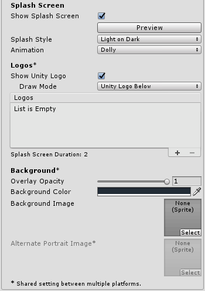

# Unity笔记3
> 17/1/3 unity5.5

## [Setting Manager 设置管理器](https://docs.unity3d.com/Manual/comp-ManagerGroup.html)

### [Network Manager](https://docs.unity3d.com/Manual/class-NetworkManager.html)


属性 | 功能
------------ | -------------
Debug Level | 对应等级的调试信息会被输出到控制台
Sendrate | 每秒数据发送次数

#### 注意
 善用调试等级可以更方便优化游戏网络效率,当等级为0时,仅输出错误信息

当物体设为 `Unreliable` 时,每次

都会发送该物体信息,当物体设为 `Reliable Delta Compressed` 时,仅在物体改变时发送物体信息

### [Physics Manager](https://docs.unity3d.com/Manual/class-NetworkManager.html)

属性 | 功能
------------ | -------------
Gravity | 应用到所有刚体上的重力,一般来说只有Y轴有. 注意: 如果加大重力,那么你可能需要提高“Solver Iteration Count” 以保证稳定.
Default Material | 创建碰撞器时默认使用的物理材质.
Bounce Threshold | 当两个碰撞物体的相对速度小于此值时,不产生反弹效果,这可以减少抖动,因此不建议将此值设低
Sleep Threshold	 | 单位动能临界值. 单位动能低于此值的刚体可能会进入睡眠状态(即停止运动).
Default Contact Offset | 产生碰撞判定的距离 该值如果设置过小会产生抖动问题. 默认: 0.01. 
Solver Iteration Count | 物理模拟精度. 对大多数情况来说,7是一个比较合适的数值
Queries Hit Triggers	 | 如果启用,任何 Raycast, SphereCast, SphereTest等都会与碰撞器产生碰撞事件.  raycasts自身的设置中可以覆盖这个选项.
Enable Adaptive Force | 更真实的模拟多个物体间的相互作用. 
Layer Collision Matrix | 定义各层碰撞系统的行为.

#### 注意
物理管理器的设置项是为了对物理模拟的精细程度进行限制,越精细资源消耗越大,因此需要在真实和性能上找到一个平衡点

### [Physics 2D Settings](https://docs.unity3d.com/Manual/class-Physics2DManager.html)


属性 | 功能
------------ | -------------
Velocity Iterations | 速度效果的迭代次数.越高越精细,但更消耗CPU资源.
Position Iterations | 位移的迭代次数. 越高越精细,但更消耗CPU资源.
Velocity Threshold | 当相对速度低于此值时,碰撞视为非弹性碰撞
Max Linear Correction | 物体最大位置修正(从 0.0001 到 1000000). 提高该值有助于缓解穿透问题.
Max Angular Correction  | 物体最大角度修正(从 0.0001 到 1000000). 提高该值有助于缓解穿透问题.
Max Translation Speed | 在一次物理运算中物体最大位移速度.
Max Rotation Speed | 在一次物理运算中物体最大旋转速度.
Min Penetration For Penalty | 在产生反作用力之前最小的穿透半径.(即两物体重叠多少后开始产生反作用力,相互弹开)
Baumgarte Scale | 用于调节物体以多快的速度互相接触算作碰撞.
Baumgarte Time of Impact Scale | 用于调节物体重叠多长时间后算作碰撞.
Time to Sleep | 刚体进入停止多少秒后进入睡眠状态.
Linear Sleep Tolerance | 当线速度小于此值时,物体进入停止状态.
Angular Sleep Tolerance | 当旋转速度小于此值时,物体进入停止状态.
Queries Start In Colliders | 从内部开始检测碰撞?
Change Stops Callbacks | 当移动或删除碰撞中的物体时,立即停止回调

## [Player Settings](https://docs.unity3d.com/Manual/class-PlayerSettings.html)
这项设置用于Unity在编译游戏时使用,少数设置是通用的,但大多数设置与目标平台有关,具体如下:
* Resolution and Presentation: 设置分辨率和显示方式,例如1280*720 全屏
* Icon: 游戏桌面图标.
* Splash Image: 启动图像.
* Other Settings: any remaining settings specific to the platform.
* Publishing Settings: 发布设置.


属性 | 功能
------------ | -------------
Company Name | 公司名称. This is used to locate the preferences file.
Product Name | 项目名称,将显示在标题栏 is used to locate the preferences file also.
Default Icon | 默认图标. You can override this for specific platforms.
Default Cursor |默认光标
Cursor Hotspot	| 光标的默认起始位置.

### [Splash Screen](https://docs.unity3d.com/Manual/class-PlayerSettingsSplashScreen.html)
Unity可以自定义加载界面,但是免费版有以下限制:
* 不能取消加载界面
* 不能取消Unity的Logo
* 透明度不能低于0.5.



属性 | 功能
------------ | -------------
Show Splash Screen | 是否显示加载界面
Preview | 预览加载界面. 可以方便的查看在各种设备下的显示效果
Splash Style	 | 选择黑色或白色风格的Unity标志
Animation | 设置加载界面的动画模式.Static,Dolly或者Custom.
Show Unity logo | 显示Unity的Logo
Draw Mode | 如何显示Logo<br>**`Unity Logo Below`**:将Unity的Logo显示在最后<br>**`All Sequential`**:将Unity Logo放到Logo列表中
Logos | Logo列表,可设定显示时间,显示顺序等,可以使用空Logo设定前后两个Logo之间的时间间隔
Overlay Opacity	 | Logo背景透明度.
Background Color | 背景颜色,受 Overlay Opacity	 影响
Background Image | 背景图片,显示方式根据长宽铺满屏幕,因此可能有部分图像不会显示出来,可以使用 **Alternate Portrait Image** 设置一个横纵比相反的背景图像,以适应手机等屏幕

## [Quality Settings](https://docs.unity3d.com/Manual/class-QualitySettings.html)
Unity允许你设置图像质量,可以对不同平台设置不同的质量等级
> 略

## [Streaming Assets](https://docs.unity3d.com/Manual/StreamingAssets.html)
明文文件的文件读取路径
* 桌面	`path = Application.dataPath + "/StreamingAssets";`
* IOS	` path = Application.dataPath + "/Raw";`
* 安卓	` path = "jar:file://" + Application.dataPath + "!/assets/";`

## [动态更新资源](https://docs.unity3d.com/Manual/ModifyingSourceAssetsThroughScripting.html)
使用代码更改资源,比如当获得无敌状态时,可以改变人物的样子来表示人物正处于无敌状态,这个例子动态改变了材质组件的阴影资源,当然这个改变是临时的,退出游戏后不会保存

```c#
private var invincibleShader = Shader.Find ("Specular");

function StartInvincibility {
    renderer.material.shader = invincibleShader;
}
```
你可以直接更改资源,这个操作会直接保存,在下次游戏时不会恢复.

```c#
private var invincibleShader = Shader.Find ("Specular");

function StartInvincibility {
    renderer.sharedMaterial.shader = invincibleShader;
}
```
以上操作适用于`Materials`,`Meshes`和`Physic Materials`这三个
对于 `Texture2D` 和 `TerrainData` 的更改将始终是永久性的,不能被撤销,因此需要自己处理相关问题

## Rigidbody 2D
任何类型是 **Dynamic** 的物体都不要通过修改位移移动它,当只添加碰撞器,不添加刚体组件时,默认隐藏的刚体类型是**Static**

